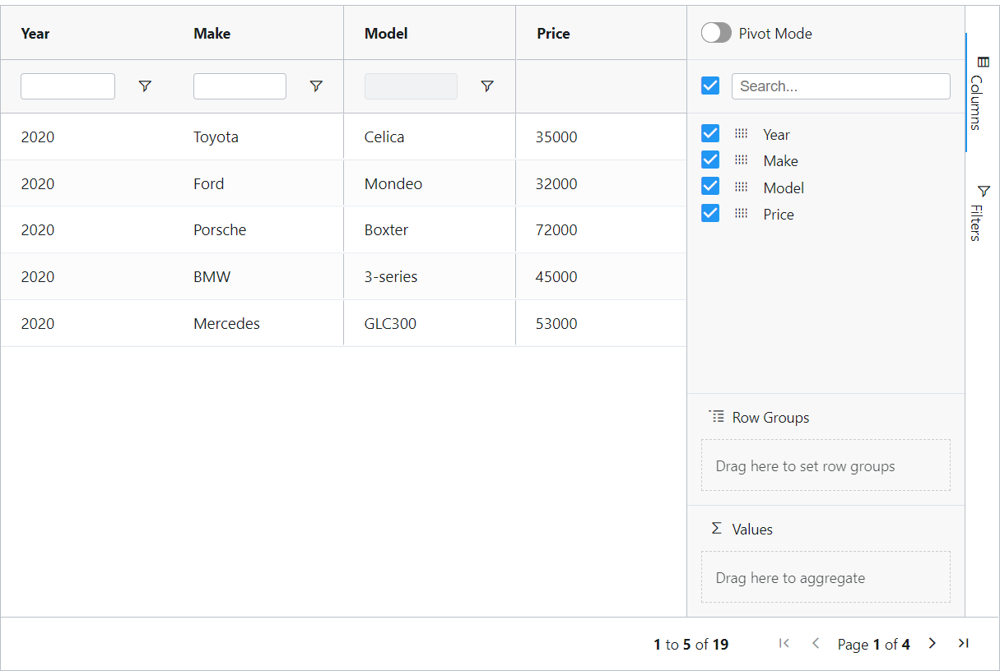
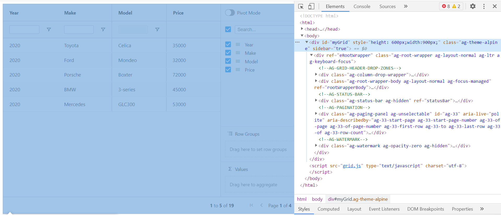
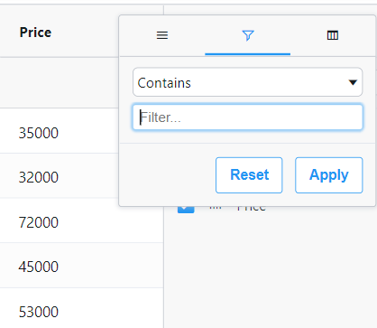
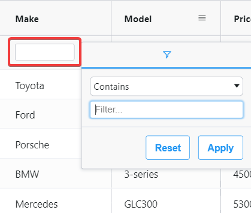
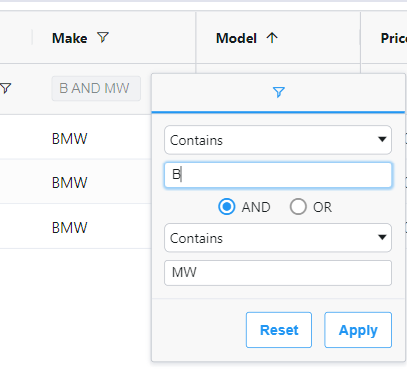
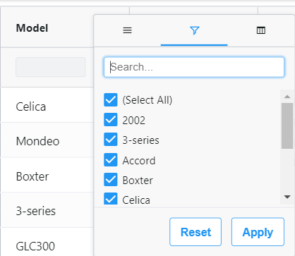

# cypress-ag-grid
Cypress plugin for interacting with and validating against ag grid.

## Table of Contents
  * [Installation](#installation)
  * [Usage](#usage)
    + [Grid Interaction](#)
        - [Getting Data From the Grid](#getting-data-from-the-grid)
        - [Getting Select Row Data](#getting-select-row-data)
        - [Getting Elements From the Grid](#getting-elements-from-the-grid)
        - [Sorting Columns](#sorting-columns)
        - [Pinning Columns](#pinning-columns)
    + [Grid Filtering](#)
        - [Filter Options](#filter-options)
        - [Filter by Text - Column Menu](#filter-by-text---column-menu)
        - [Filterby Text - Floating Filter](#filterby-text---floating-filter)
        - [Filter by Checkbox - Column Menu](#filter-by-checkbox---column-menu)
        - [Filtering - Localization and Internationalization](#filtering---localization-and-internationalization)
        - [Add or Remove Columns](#add-or-remove-columns)
    + [Grid Validation](#)
        - [Validate Paginated Table](#validate-paginated-table)
        - [Validate Table in the Exact Order](#validate-table-in-the-exact-order)
        - [Validate Subset of Table Data](#validate-subset-of-table-data)
        - [Validate Empty Grid](#validate-empty-grid)
  * [Limitations](#limitations)
  * [Credit](#credit)
<br/>
<br/>

## Installation

```bash
npm install cypress-ag-grid --save-dev
```
Then include the following in your `support/index.js` file (Cypress v9 and below) or `support/e2e.(js|ts)` file (Cypress 10 and above):

```javascript
import "cypress-ag-grid";
```
## Usage
Consider the ag grid example below:


With the following DOM structure:

<br/>
<br/>
### Getting Data From the Grid:
To get the Ag Grid data, you must chain `.getAgGridData()` after the `cy.get()` command for the topmost level of the grid, including controls and headers (see selected DOM element in above image).

Correct Usage:
```javascript
cy.get("#myGrid").getAgGridData()
```

Incorrect Usage:
```javascript
cy.getAgGridData();
```

The correct command will return the following:
```json
[
    { "Year": "2020", "Make": "Toyota", "Model": "Celica" },
    { "Year": "2020", "Make": "Ford", "Model": "Mondeo" },
    { "Year": "2020", "Make": "Porsche", "Model": "Boxter" },
    { "Year": "2020", "Make": "BMW", "Model": "3-series" },
    { "Year": "2020", "Make": "Mercedes", "Model": "GLC300" },
]
```
</br>
</br>

### Getting Select Row Data
To only get certain rows of data, pass the header values into the `getAgGridData()` command, like so:

```javascript
cy.get("#myGrid").getAgGridData({ onlyColumns: ["Year", "Make"] })
```

The above command will return the follwoing:
```json
[
    { "Year": "2020", "Make": "Toyota"},
    { "Year": "2020", "Make": "Ford"},
    { "Year": "2020", "Make": "Porsche"},
    { "Year": "2020", "Make": "BMW"},
    { "Year": "2020", "Make": "Mercedes"},
]
```
</br>
</br>

### Getting Elements From the Grid
To get the Ag Grid data as elements (if you want to interact with the cells themselves), you must chain `.getAgGridElements()` after the `cy.get()` command for the topmost level of the grid, including controls and headers (see selected DOM element in above image).
```javascript
    cy.get(agGridSelector)
      .getAgGridElements()
      .then((tableElements) => {
        const porscheRow = tableElements.find(
          (row) => row.Price.innerText === "72000"
        );
        const priceCell = porscheRow.Price;
        cy.wrap(priceCell).dblclick().type("66000{enter}");
      });

```

The above example will grab the table as elements, finds the row whose `Price` equals `72000`. It then gets the `Price` cell for that row, double clicks on it to enable an editable input, and changes the value of the cell.
</br>
</br>

### Sorting Columns
This command will sort the specified column by the sort direction specified.

<b>Defintion</b>:
`.agGridSortColumn(columnName:String, sortDirection:String)`

Example:

```javascript
cy.get("#myGrid").agGridSortColumn("Model", "descending");
```
</br>
</br>

### Pinning Columns
This command will pin the specified column.
<b>Definition</b>
`.agGridPinColumn(columnName: string, pin: ['left', 'right', null])`

Example:
```javascript
cy.get("#myGrid").agGridPinColumn("Model", "left") // Pins the "Model" column to the left
cy.get("#myGrid").agGridPinColumn("Model", "right") // Pins the "Model" column to the right
cy.get("#mGrid").agGridPinColumn("Model") // Removes the pin

```
</br>
</br>

### Filter Options

The below filtering commands takes an `options` parameter comprised of the following properties:

```javascript
options: {
    searchCriteria: [{
        columnName: string;
        filterValue: string;
        operator?: string;
        isMultiFilter?: boolean;
    }];
    hasApplyButton?: boolean;
    noMenuTabs?: boolean;
    selectAllLocaleText: string;
}

/**
- options.searchCriteria JSON with search properties and options
- options.searchCriteria.columnName name of the column to filter
- options.searchCriteria.filterValue value to input into the filter textbox
- options.searchCriteria.searchInputIndex [Optional] Uses 0 by default. Index of which filter box to use in event of having multiple search conditionals
- options.searchCriteria.operator [Optional] Use if using a search operator (i.e. Less Than, Equals, etc...use filterOperator.enum values).
- options.searchCriteria.isMultiFilter [Optional] Used when floating filter menu has checkbox options vs freeform text input.
- options.hasApplyButton [Optional] True if "Apply" button is used, false if filters by text input automatically.
- options.noMenuTabs [Optional] True if you use, for example, the community edition of ag-grid, which has no menu tabs
- options.selectAllLocaleText [Optional] Pass in the locale text value of "Select All" for when you are filtering by checkbox - this will first deselect the "Select All" option before selecting your filter value
*/
```

### Filter by Text - Column Menu
This command will filter a column by a text value from its menu. In the options, you must specify a `searchCriteria` objects containing one or more objects with `columnName`, `filterValue`, and optionally `operator` (i.e. Contains, Not contains, Equals, etc.).



<b>Definition:</b> `.agGridColumnFilterTextMenu(options: {})`

Example:
```javascript
cy.get("#myGrid").agGridColumnFilterTextMenu({
        searchCriteria:[{
            columnName: "Model",
            filterValue: "GLC300",
            operator:"Equals"
            },
            {
            columnName: "Make",
            filterValue: "Mercedes",
            operator:"Equals"
            }
        ],
    hasApplyButton: false
})
````
The above command will filter the Model column for the value 'GLC300' and set the filter operator to 'Equals'. It will then apply a secondary filter on the Make column for 'Mercedes'.
</br>
</br>
### Filterby Text - Floating Filter
This command will filter a column by a text value from its floating filter (if applicable). This command will filter a column by a text value from its floating menu. In the options, you must specify a `searchCriteria` object with `columnName`, `filterValue`, and optionally `operator` (i.e. Contains, Not contains, Equals, etc.) and `searchInputIndex` in the event you wish to apply multiple text conditions (see below for multi-condition example).



<b>Definition:</b> .agGridColumnFilterTextFloating(options: {})

Example:
```
    cy.get(agGridSelector).agGridColumnFilterTextFloating({
      searchCriteria: {
        columnName: "Make",
        filterValue: "Ford",
      },
      hasApplyButton: true,
    });
```

The above example will search for the Make `Ford` from the floating text menu filter.

If you have the option for multiple conditions on the floating filter, you can do two searches, specifying the `searchInputIndex` parameter in the `searchCriteria` object. The below example will ssarch for any `Make` that contains `B` AND `MW`:

Example: 
```
    cy.get(agGridSelector).agGridColumnFilterTextFloating({
      searchCriteria: {
        columnName: "Make",
        filterValue: "B",
        searchInputIndex: 0,
      },
      hasApplyButton: true,
    });
    cy.get(agGridSelector).agGridColumnFilterTextFloating({
      searchCriteria: {
        columnName: "Make",
        filterValue: "MW",
        searchInputIndex: 1,
      },
      hasApplyButton: true,
    });
```


<br/>
</br>

### Filter by Checkbox - Column Menu
This command will filter a column by a checkbox text value from its menu.


Definition:
```javascript
.agGridColumnFilterCheckboxMenu(options={})
```

Example:
```javascript
    cy.get("#myGrid").agGridColumnFilterCheckboxMenu({
      searchCriteria: {
        columnName: "Model",
        filterValue: "2002",
      },
      hasApplyButton: true,
    });

```
</br>

### Filtering - Localization and Internationalization
When we filter by checkbox, we first deselect the Select All checkbox to ensure we ONLY select the specified checkbox. Since AG grid allows for localization, we need a way to be able to pass in the localeText for Select All. This is the only area of this plugin that has a hard-coded value, so no other localization accommodations are needed.

```
    cy.get("#myGrid").agGridColumnFilterCheckboxMenu({
      searchCriteria: {
        columnName: "Model",
        filterValue: "2002",
      },
      selectAllLocaleText: "Tout Sélectionner"
      hasApplyButton: true,
    });
```   
</br>

### Add or Remove Columns
This command will toggle the specified column from the grid's sidebar.

<b>Definition:</b>`.agGridToggleColumnsSideBar(columnName:String, doRemove:boolean)`

Example:
```javascript
// This will remove the column "Year" from the grid
cy.get("#myGrid").agGridToggleColumnsSideBar("Year", true);
```
<br/>
<br/>

### Validate Paginated Table
This command will validate the paginated grid's data. The supplied expectedPaginatedTableData must be paginated as it's shown in the grid.

<b>Definition:</b> `agGridValidatePaginatedTable(expectedPaginatedTableData, onlyColumns = {})`

Example:
```javascript
    const expectedPaginatedTableData = [
      [
        { "Year": "2020", "Make": "Toyota", "Model": "Celica" },
        { "Year": "2020", "Make": "Ford", "Model": "Mondeo" },
        { "Year": "2020", "Make": "Porsche", "Model": "Boxter" },
        { "Year": "2020", "Make": "BMW", "Model": "3-series" },
        { "Year": "2020", "Make": "Mercedes", "Model": "GLC300" },
      ],
      [
        { "Year": "2020", "Make": "Honda", "Model": "Civic" },
        { "Year": "2020", "Make": "Honda", "Model": "Accord" },
        { "Year": "2020", "Make": "Ford", "Model": "Taurus" },
        { "Year": "2020", "Make": "Hyundai", "Model": "Elantra" },
        { "Year": "2020", "Make": "Toyota", "Model": "Celica" },
      ],
      ...other table data
    ];
    cy.get("#myGrid").agGridValidatePaginatedTable(
      expectedPaginatedTableData, onlyColumns ={"Year", "Make", "Model"}
    );
  });
```
<br/>
<br/>

### Validate Table in the Exact Order
This command will verify the table data is displayed exactly in the same order as the supplied expected table data. This will ONLY validate the first page of a paginated table.

<b>Definition</b>: `.agGridValidateRowsExactOrder(actualTableData, expectedTableData)`

Example:
```javascript
cy.get("#myGrid")
.getAgGridData()
.then((actualTableData) => {
    cy.agGridValidateRowsExactOrder(actualTableData, expectedTableData);
});
```
<br/>
<br/>

### Validate Subset of Table Data
This command will validate a subset of the table data. Ideal for verifying one or more records, or verify records without specified columns.

<b>Definition:</b>: `agGridValidateRowsSubset(actualTableData, expectedTableData)`

Example:
```javascript
    const expectedTableData = [
      { "Year": "2020", "Make": "Toyota", "Model": "Celica" },
      { "Year": "2020", "Make": "Ford", "Model": "Mondeo" },
      { "Year": "2020", "Make": "Porsche", "Model": "Boxter" },
      { "Year": "2020", "Make": "BMW", "Model": "3-series" },
      { "Year": "2020", "Make": "Mercedes", "Model": "GLC300" },
    ];
    cy.get(agGridSelector)
      .getAgGridData({ onlyColumns: ["Year", "Make", "Model"] })
      .then((actualTableData) => {
        cy.agGridValidateRowsSubset(actualTableData, expectedTableData);
      });
  });
```
<br/>
<br/>

### Validate Empty Grid
This will verify the table data is empty.

<b>Definition</b>:`agGridValidateEmptyTable(actualTableData, expectedTableData)`

Example:
```javascript
    cy.get(agGridSelector)
      .getAgGridData()
      .then((actualTableData) => {
        cy.agGridValidateEmptyTable(actualTableData);
      });
```

## Limitations
* ~~Unable to validate deeply nested row groups~~ As of v2.x, using `.getAgGridElements()` you should be able to accomplish this.
* ~~Unable to validate deeply nested column groups~~ As of v2.x, using `.getAgGridElements()` you should be able to accomplish this.
* Unable to validate the entirety of an unlimited scrolling grid.
* Unable to validate data that is out of view. The DOM will register the ag grid data as it's scrolled into view.
  * To combat this, in your code where the ag grid is called, check if the Cypress window is controlling the app and set the ag grid object to `.sizeColumnsToFit()`. You can see an example of this in the `app/grid.js` file of this repository. Read more [here](https://www.ag-grid.com/javascript-grid/column-sizing/#size-columns-to-fit)
  * Example: 
  ```javascript
  if(window.Cypress){
      this.api.sizeColumnsToFit();
  }
  ``` 
## Credit
A portion of the logic to retrieve table data was expanded upon from the project [Cypress-Get-Table](https://github.com/roggerfe/cypress-get-table) by [Rogger Fernandez](https://github.com/roggerfe).
